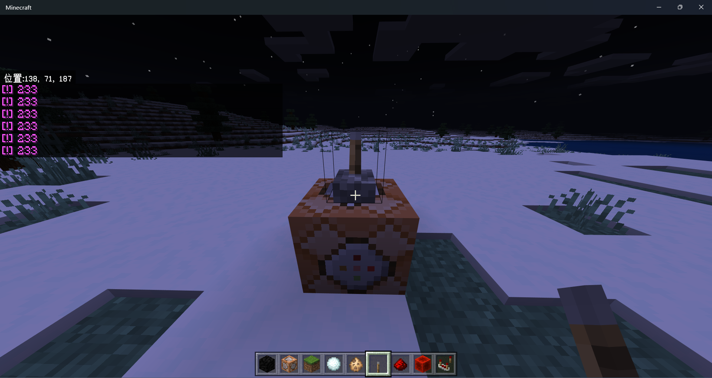
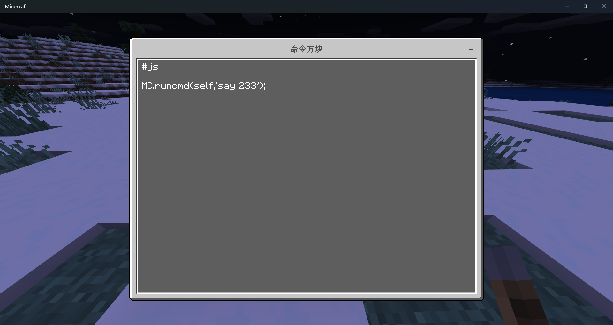
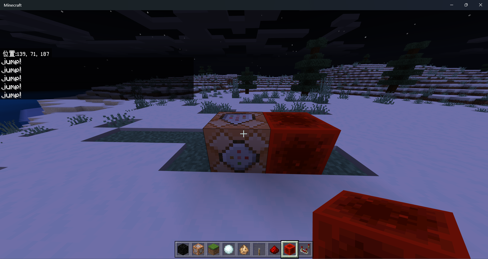
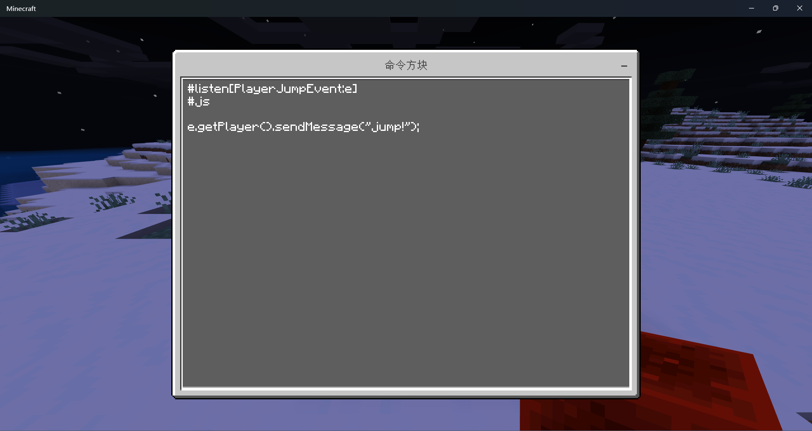

# Super Command Block

## 介绍
此插件是基于 [VanillaCommandBlock](https://github.com/wode490390/VanillaCommandBlock) 的修改版本,添加了js运行支持和监听器支持,未来计划加入be所有原版命令

只能运行在 [PowerNukkit](https://github.com/PowerNukkit/PowerNukkit) 核心上，~~不会还有人用nkx吧不会吧不会吧~~

此插件还在开发，欢迎开发者加入，现在非常缺人手:(

## 功能
- [ ] 命令
  - [x] 选择器
  - [ ] ...... 
- [x] js运行支持
- [x] 监听器支持

## 演示
#### js运行:

#### 监听器(PlayerJumpEvent):

## js/监听器编写教程
//todo

## 下载
//todo

## 编译
1. 将源码拉取下来
2. 确保你的ide支持并安装了 [Maven](https://maven.apache.org/) 
3. 运行 mvn clean package,jar包将会出现在项目的/target目录下
